<p align="center">
  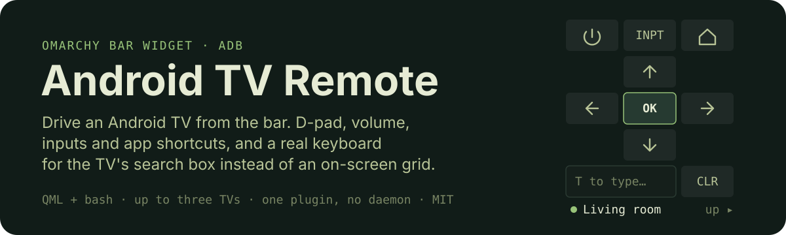
</p>

<p align="center">
  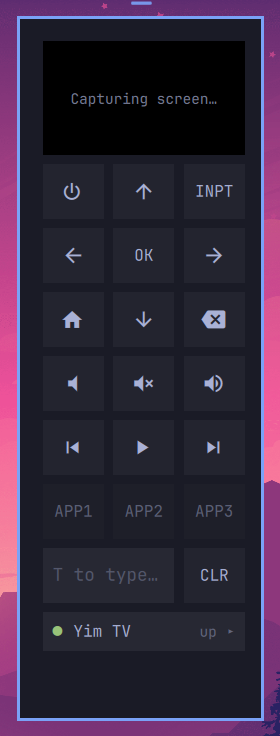
  &nbsp;&nbsp;
  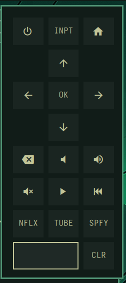
  &nbsp;&nbsp;
  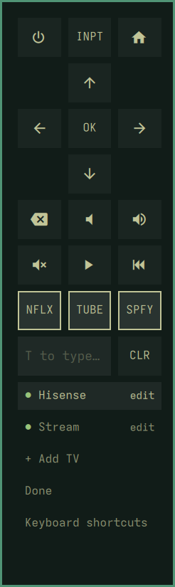
</p>

<p align="center"><sub>As it opens &nbsp;·&nbsp; with the picker expanded &nbsp;·&nbsp; in edit mode. Everything here is configured from the pad itself.</sub></p>

The bar icon opens a remote pad. With the pad open the keyboard drives the TV:
arrows and letters are remote keys, and `T` switches to typing into whatever
field the TV has focused. Up to three TVs, switched from the picker along the
foot of the pad. The widget shells out to a small bash script that owns all of
ADB, so the same script works from a terminal without the shell running.

<p align="center">
  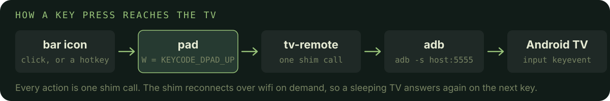
</p>

<p align="center">
  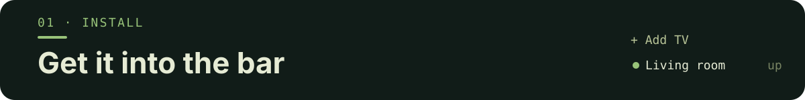
</p>

<a name="requirements"></a>
<p align="center">
  
</p>

- Omarchy with the Quickshell-based shell (`omarchy-shell`)
- `adb`
- An Android TV with **Developer options → USB/Wireless debugging** enabled,
  reachable on your network

<p align="center">
  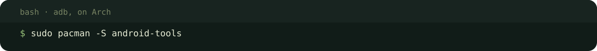
</p>

```bash
sudo pacman -S android-tools
```

<a name="one-command"></a>
<p align="center">
  
</p>

<p align="center">
  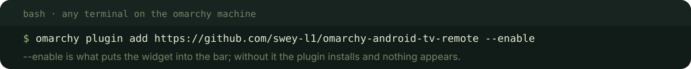
</p>

```bash
omarchy plugin add https://github.com/swey-l1/omarchy-android-tv-remote --enable
```

Then open the pad, click the picker along its foot, and use **+ Add TV**: a
name and the TV's address (Settings → Network → Status on the TV). A bare IP
gets `:5555` appended. Renaming, removing and choosing the shortcut apps all
happen in the same place; see [The picker](#the-picker).

If you would rather configure in a file:

<p align="center">
  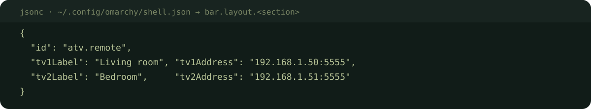
</p>

<details markdown="1">
<summary>Copy the snippet</summary>

```jsonc
// ~/.config/omarchy/shell.json  → bar.layout.<section>
{
  "id": "io.github.swey-l1.atv-remote",
  "tv1Label": "Living room", "tv1Address": "192.168.1.50:5555",
  "tv2Label": "Bedroom",     "tv2Address": "192.168.1.51:5555"
}
```

</details>

The first connection prompts **"Allow USB debugging?"** on the TV. Tick
"Always allow from this computer". If that prompt is dismissed the set is stuck
in `unauth`, which the picker shows with an **AUTH** button to put the prompt
back on screen. See [Re-authorising a TV](#re-authorising-a-tv).

<p align="center">
  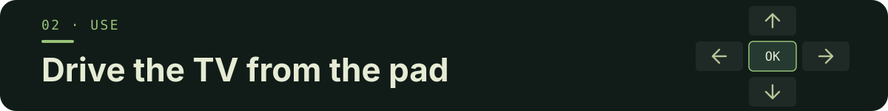
</p>

<p align="center">
  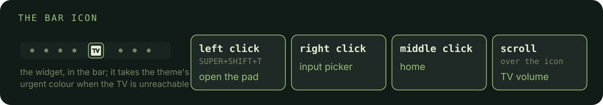
</p>

<details markdown="1">
<summary>As a table</summary>

| Interaction | Does |
|---|---|
| Left click / `SUPER+SHIFT+T` | Open the remote pad |
| Right click | Input / source picker |
| Middle click | Home |
| Scroll over the icon | TV volume |

</details>

<a name="keyboard"></a>
<p align="center">
  
</p>

With the pad open the keyboard drives the TV. It is modal, the way a real remote
is: typing at the TV is something you enter deliberately with `T`, because
otherwise every letter would be text bound for the search box and none of them
could be a control.

<p align="center">
  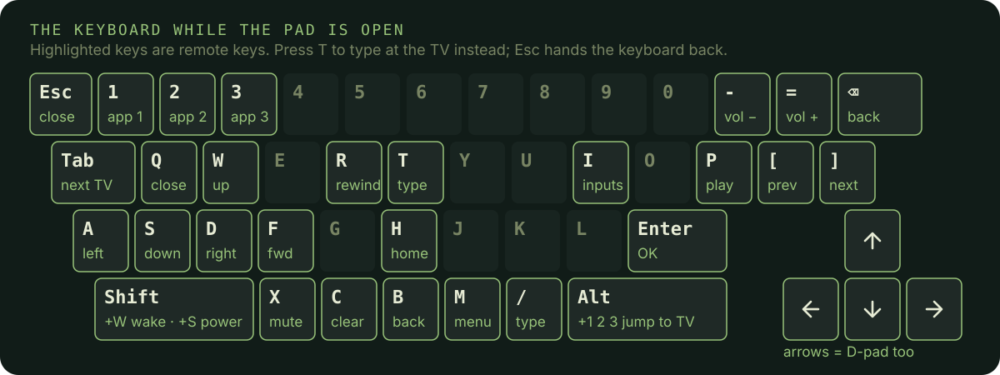
</p>

<details markdown="1">
<summary>Every key, as a table</summary>

| Key | Does |
|---|---|
| Arrows or `W` `A` `S` `D` | D-pad |
| `Enter` | Select / OK |
| `B` or `Backspace` | Back |
| `H` | Home |
| `M` | Menu |
| `I` | Input / source picker |
| `C` | Clear the field on the TV |
| `P` | Play / pause |
| `R` / `F` | Rewind / fast-forward |
| `[` / `]` | Previous / next |
| `-` / `=` or `+` | Volume down / up |
| `X` | Mute |
| `Shift+W` / `Shift+S` | Wake / power |
| `1` `2` `3` | The three app shortcuts |
| `T` or `/` | Type at the TV. `Esc` hands the keyboard back |
| `Tab` | Switch to the next configured TV |
| `Alt+1` / `Alt+2` / `Alt+3` | Jump straight to that TV |
| `Esc` or `Q` | Close the pad |

</details>

Hovering anything in the pad names it, and its key, along the bottom of the
pad. **Keyboard shortcuts** in the picker lists the lot, including the keys with
no button of their own.

Both power-state keys sit behind `Shift`, since `W` and `S` are D-pad directions.
Power especially: it cannot be undone from this side, because a TV that is off
does not answer ADB, so a stray press by someone who forgot to hit `T` first
would end the session.

Clicking the text field enters typing mode too, and the placeholder reads
**T to type…** as a reminder that the pad is modal. **CLR** wipes whatever
field the TV has focused.

<a name="the-picker"></a>
<p align="center">
  
</p>

The picker is one line showing the TV being driven and whether it is reachable.
Click it to list every configured set with its own status, and click a set to
switch to it. **+ Add TV** at the foot of that list takes a name and an address
and saves them; a bare IP gets `:5555` appended. The row disappears once all
three slots are used.

**Edit / remove** below it flips the list into edit mode, where a click opens a
set for rename or deletion rather than switching to it. Deleting the set you are
currently driving moves you to the first one left.

Edit mode also outlines the three shortcut buttons, and clicking one then sets
what it launches rather than launching it: the pad reads the launchable apps off
the TV and lists them to choose from.

Which TV you are on is remembered across restarts. The other sets only have
their reachability refreshed while the list is open, so three configured TVs do
not mean three times the adb traffic on every poll.

To type, press `T` (or click the field), type, press Enter, and the string is
sent and submitted. `Esc` hands the keyboard back to the controls. **Up/Down**
walks the last 10 things you typed.

The icon turns your theme's urgent colour when the TV is unreachable, and
the tooltip distinguishes "TV unreachable", "adb not installed" and a TV that
needs authorising.

<a name="re-authorising-a-tv"></a>
<p align="center">
  
</p>

A set whose debugging prompt was dismissed (or that was reset, or had this
machine's key revoked) sits in `unauth` forever. Reconnecting does not help:
`adb` remembers the refusal and fails the handshake silently, with nothing on
the TV's screen. The **AUTH** button beside an `unauth` entry bounces the local
adb server, which forces a fresh key exchange and puts the prompt back up.

Bouncing the server drops *every* connected device for a moment, including your
other TVs. They reconnect on their next action, so the drop is brief. It is also
why AUTH only appears when it is the fix.

<a name="optional-hotkey"></a>
<p align="center">
  
</p>

<p align="center">
  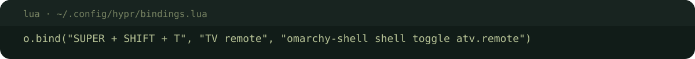
</p>

<details markdown="1">
<summary>Copy the binding</summary>

```lua
-- ~/.config/hypr/bindings.lua
o.bind("SUPER + SHIFT + T", "TV remote", "omarchy-shell shell toggle io.github.swey-l1.atv-remote")
```

</details>

<p align="center">
  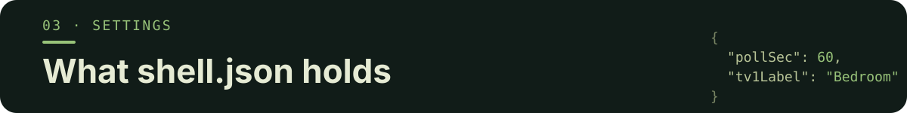
</p>

<p align="center">
  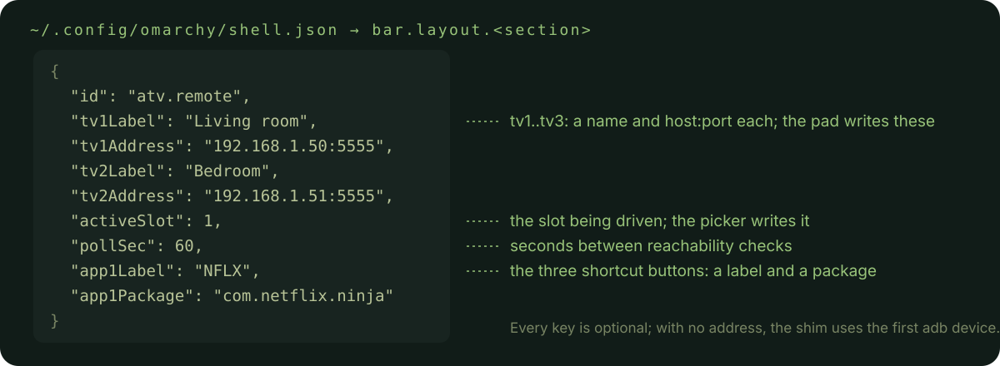
</p>

<details markdown="1">
<summary>Every key, with its default</summary>

| Key | Default | What |
|---|---|---|
| `tv1Label` / `tv1Address` | — | Name and `host:port` of the first TV |
| `tv2Label` / `tv2Address` | — | Second TV |
| `tv3Label` / `tv3Address` | — | Third TV |
| `activeSlot` | `0` | The slot being driven; the picker writes it |
| `pollSec` | `60` | Seconds between reachability checks |
| `app1Label` / `app1Package` | `APP1` | First shortcut button, e.g. `NFLX` / `com.netflix.ninja` |
| `app2Label` / `app2Package` | `APP2` | Second shortcut |
| `app3Label` / `app3Package` | `APP3` | Third shortcut |

</details>

You should not need to set `activeSlot` by hand. With every address empty the
shim falls back to the first connected adb device. The shortcut buttons are
settable from the pad; see [The picker](#the-picker).

The pad can list them for you, and `tv-remote apps` prints the same list from a
terminal. Android exposes app labels to other apps but not to `adb`, so the
picker shows a name derived from the package and leaves the button label yours
to set.

<a name="known-quirks"></a>
<p align="center">
  
</p>

- **`%` in typed text is lossy.** Android's `input text` treats `%s` as a space
  with no escape for a literal `%`, so "100%sure" types as "100 ure". This is a
  framework limitation; the plugin cannot work around it.
- **Input picker varies by brand.** The plugin sends `KEYCODE_TV_INPUT` and then
  falls back to `android.media.tv.action.SETUP_INPUTS`. On Hisense the keycode is
  a no-op and the vendor source panel is only reachable through protected
  broadcasts ADB cannot send, so the fallback is what opens a picker there.
  Other brands may behave differently.
- **Power is one-way.** A TV that is off does not answer ADB, so the power key
  can turn it off but not on.
- **ADB over wifi drops when the TV sleeps.** Every action reconnects on demand,
  so this is usually invisible.

<a name="using-the-shim-directly"></a>
<p align="center">
  
</p>

`tv-remote` is a plain script and works on its own:

<p align="center">
  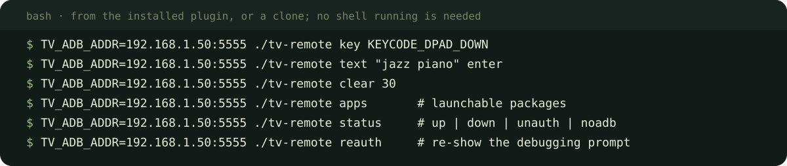
</p>

<details markdown="1">
<summary>Copy the commands</summary>

```bash
TV_ADB_ADDR=192.168.1.50:5555 ./tv-remote key KEYCODE_DPAD_DOWN
TV_ADB_ADDR=192.168.1.50:5555 ./tv-remote text "jazz piano" enter
TV_ADB_ADDR=192.168.1.50:5555 ./tv-remote clear 30
TV_ADB_ADDR=192.168.1.50:5555 ./tv-remote apps       # launchable packages
TV_ADB_ADDR=192.168.1.50:5555 ./tv-remote status     # up | down | unauth | noadb
TV_ADB_ADDR=192.168.1.50:5555 ./tv-remote reauth     # re-show the debugging prompt
```

</details>

<p align="center">
  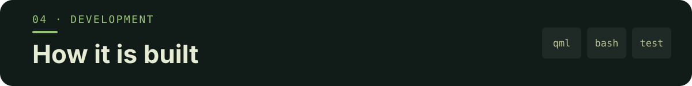
</p>

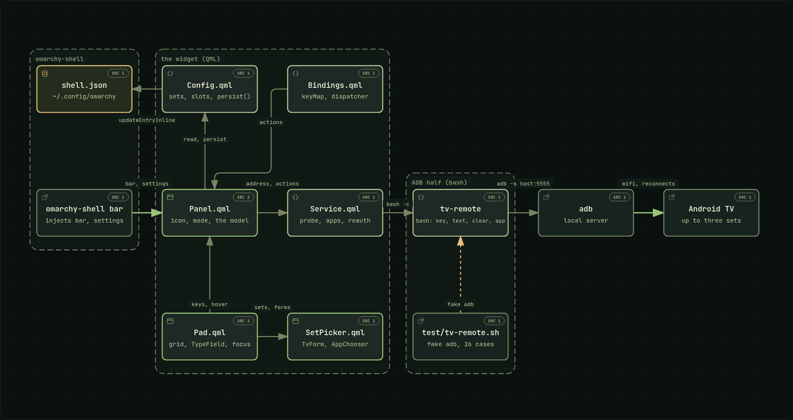

How a key press reaches the TV. The second diagram is the file map: every QML
file once, and what each is built from.

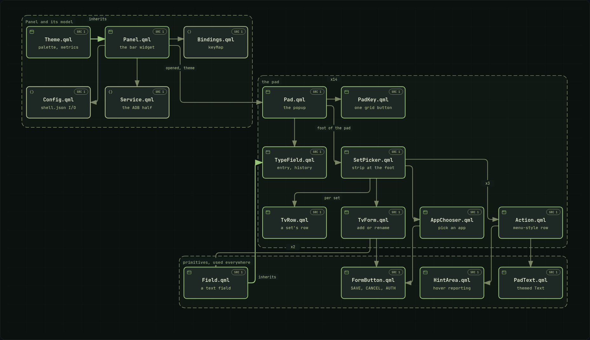

The third merges the two: every file and the whole path to the TV on one page.

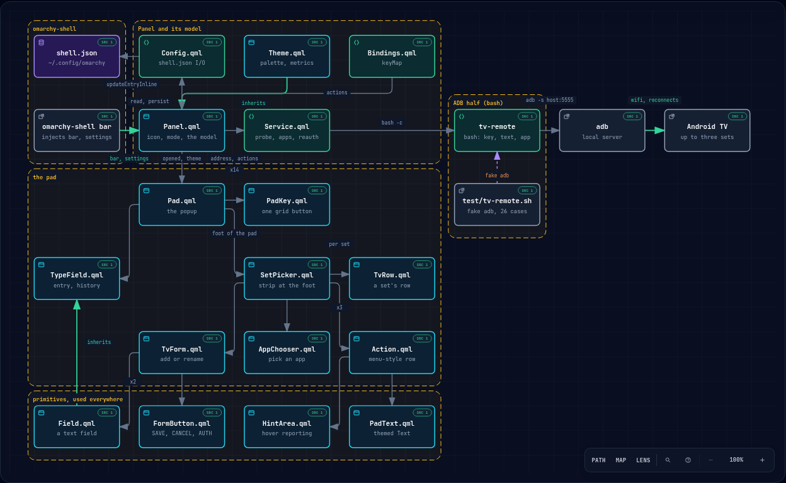

[`docs/architecture.html`](docs/architecture.html),
[`docs/components.html`](docs/components.html) and
[`docs/plugin.html`](docs/plugin.html) are the same three as interactive
pages: open them in a browser for guided views, search and export. All are
generated from the `.json` beside each with
[Archify](https://github.com/tt-a1i/archify); see `DEVELOPING.md` for the command.

The plugin is plain QML plus a shell script, so edits apply without a rebuild:

<p align="center">
  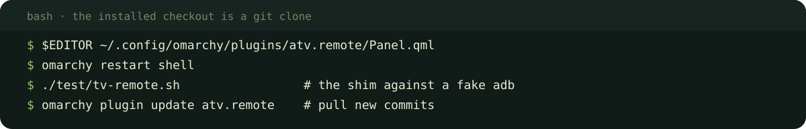
</p>

<details markdown="1">
<summary>Copy the commands</summary>

```bash
$EDITOR ~/.config/omarchy/plugins/io.github.swey-l1.atv-remote/Panel.qml
omarchy restart shell
./test/tv-remote.sh                 # the shim against a fake adb
omarchy plugin update io.github.swey-l1.atv-remote    # pull new commits
```

</details>

Files under `~/.config/omarchy/plugins/` hot-reload on save, but the bar widget
is mounted at startup, so a restart is the reliable way to see a change. The
`tv-remote` script needs no restart at all, and `./test/tv-remote.sh` checks it
against a fake `adb` without a TV in the room.

If you installed with `omarchy plugin add`, the directory is a git checkout, so
`omarchy plugin update io.github.swey-l1.atv-remote` pulls new commits. To remove it:

```bash
omarchy plugin remove io.github.swey-l1.atv-remote
```

That deletes the checkout and the widget's entry in the bar layout. The plugin
writes only its own entry in `shell.json`, and only when you act in the pad, so
nothing else of yours is touched on the way in or out.

---

<p align="center">
  <a href="https://github.com/oil-oil/beautify-github-readme"></a>
</p>

<p align="center"><sub>MIT. See <a href="LICENSE">LICENSE</a>.</sub></p>
